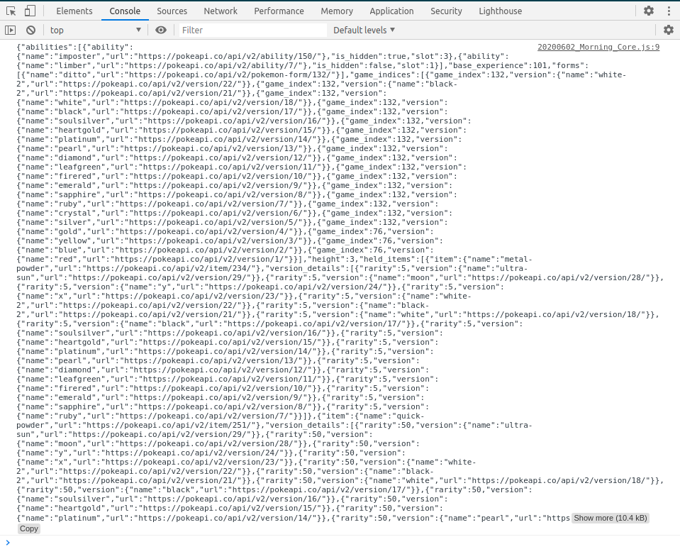
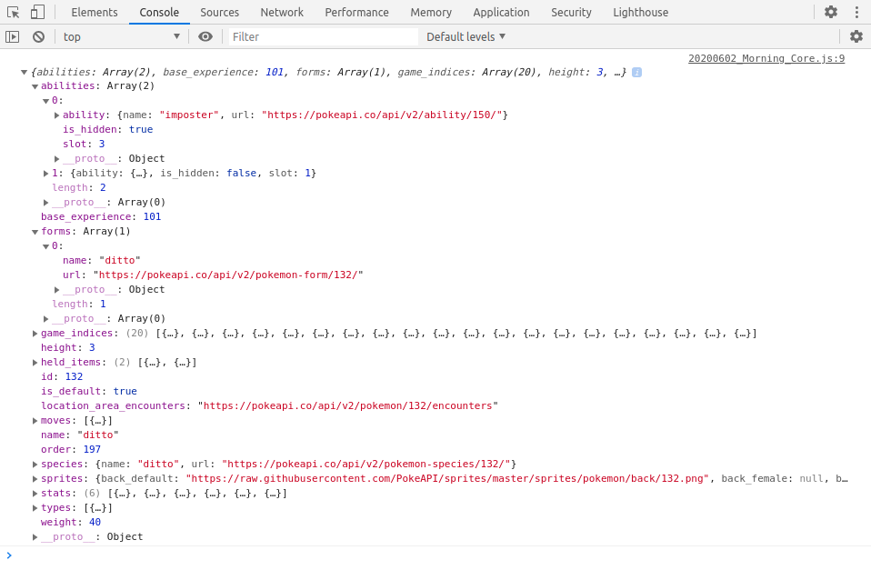

# 20200602 Morning/Afternoon Challenge

## Pokemon Callbacks (gotta callback em all)!

This morning we're gonna be playing around with callbacks by getting data from the popular https://pokeapi.co/. It's basically an app a lot like our rails apps which just returns JSON information about different pokemon.

### Core

1. Head over to https://pokeapi.co/ and play around on the website, take a look at some of the different routes that you can request data from, and the format of the data that gets returned. This is actually a really good example of the type of API you might consume as a front end developer!

2. Head over to Postman and try making some requests in there. Specifically, see if you can get the following data (in separate requests)

    1. The first 350 pokemon available
    2. The pokemon with id 199 - what's its name?
    3. All of the flying type pokemon

3. Below you'll find a JS function for making an HTTP Get request called ```makeGetRequest```, this function can be used to get data from the pokeapi (or any other API for that matter). Copy the function and bring it into your code, it takes two args, the URL and a callback which will get called with the data from the request. Test the function by running the following code ```makeGetRequest('https://pokeapi.co/api/v2/pokemon/ditto', (data) => {console.log(data)})```

4. Now, add onto the callback function so that it not only console logs the data (which will be a JSON string), but converts it into a javascript object (deserialization). 

```javascript
function makeGetRequest(theUrl, callback)
{
  const request = new XMLHttpRequest();
  request.open("GET", theUrl, true);
  request.onload = (res) => callback(res.currentTarget.responseText);
  request.send();
}
```
#### Solutions

**2.1**
```
https://pokeapi.co/api/v2/pokemon?limit=350&offset=350
```

**2.2**
```
https://pokeapi.co/api/v2/pokemon/199
Pokemon name is "Slowking"
```

**2.3**
```
https://pokeapi.co/api/v2/pokemon?type=flying

{
  "count": 964,
  "next": "https://pokeapi.co/api/v2/pokemon?offset=20&limit=20",
  "previous": null,
  "results": [
    {
      "name": "bulbasaur",
      "url": "https://pokeapi.co/api/v2/pokemon/1/"
    },
    {
      "name": "ivysaur",
      "url": "https://pokeapi.co/api/v2/pokemon/2/"
    },
    {
      "name": "venusaur",
      "url": "https://pokeapi.co/api/v2/pokemon/3/"
    },
    {
      "name": "charmander",
      "url": "https://pokeapi.co/api/v2/pokemon/4/"
    },
    {
      "name": "charmeleon",
      "url": "https://pokeapi.co/api/v2/pokemon/5/"
    },
    {
      "name": "charizard",
      "url": "https://pokeapi.co/api/v2/pokemon/6/"
    },
    {
      "name": "squirtle",
      "url": "https://pokeapi.co/api/v2/pokemon/7/"
    },
    {
      "name": "wartortle",
      "url": "https://pokeapi.co/api/v2/pokemon/8/"
    },
    {
      "name": "blastoise",
      "url": "https://pokeapi.co/api/v2/pokemon/9/"
    },
    {
      "name": "caterpie",
      "url": "https://pokeapi.co/api/v2/pokemon/10/"
    },
    {
      "name": "metapod",
      "url": "https://pokeapi.co/api/v2/pokemon/11/"
    },
    {
      "name": "butterfree",
      "url": "https://pokeapi.co/api/v2/pokemon/12/"
    },
    {
      "name": "weedle",
      "url": "https://pokeapi.co/api/v2/pokemon/13/"
    },
    {
      "name": "kakuna",
      "url": "https://pokeapi.co/api/v2/pokemon/14/"
    },
    {
      "name": "beedrill",
      "url": "https://pokeapi.co/api/v2/pokemon/15/"
    },
    {
      "name": "pidgey",
      "url": "https://pokeapi.co/api/v2/pokemon/16/"
    },
    {
      "name": "pidgeotto",
      "url": "https://pokeapi.co/api/v2/pokemon/17/"
    },
    {
      "name": "pidgeot",
      "url": "https://pokeapi.co/api/v2/pokemon/18/"
    },
    {
      "name": "rattata",
      "url": "https://pokeapi.co/api/v2/pokemon/19/"
    },
    {
      "name": "raticate",
      "url": "https://pokeapi.co/api/v2/pokemon/20/"
    }
  ]
}
 View

```

**3**
```javascript
makeGetRequest('https://pokeapi.co/api/v2/pokemon/ditto', (data) => { console.log(data) });
```


**4**
```javascript
makeGetRequest('https://pokeapi.co/api/v2/pokemon/ditto', (data) => { console.log(JSON.parse(data)) });
```



### Beast 

1. Write a function called ```getPokemonStats(pokemonName, callback)``` which will take as an argument a pokemon's name and pass an array of their stats to the callback, basically each stat will be an object with name and baseState that looks like this:

 ```[{name: "speed", baseStat: 45}, {name: "attack", baseStat: 52}, ...]```

2. Add in some error handling, so if the user passes in a pokemonName  that doesn't exist the function passes to the callback "No pokemon data found"

### Beast+

1. Write a function called ```whichPokemonIsHeavier(pokemonName1, pokemonName2, callback)``` which will take two pokemon names and call the callback with which one is heavier. The function should pass into the callback the name of the pokemon that is heavier and also by how much (ex. ```Bulbasaur is 3kgs heavier than Squirtle```). If they both weigh the same, indicate that. 

### Elite 4

1. Build a pokemon type guessing game which will prompt the user with a random pokemon asking them to guess it's type (normal, flying, fire, grass, etc.). Note that some pokemon have multiple types, in this case they just need to guess one of them. The game should have 5 questions, so 5 random pokemon whose type the user gets to guess!